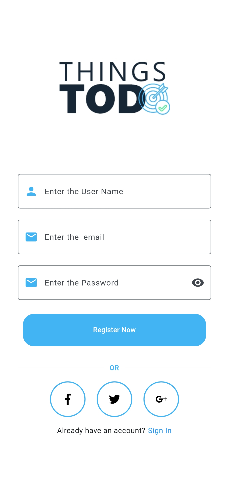
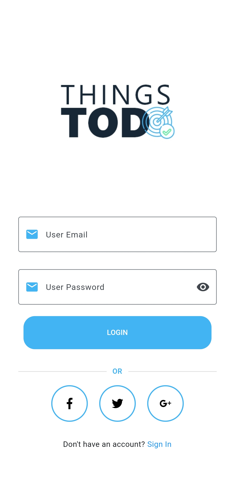
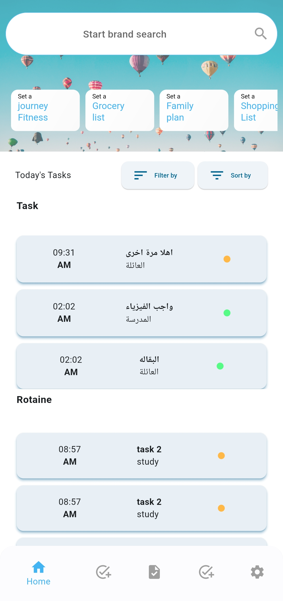
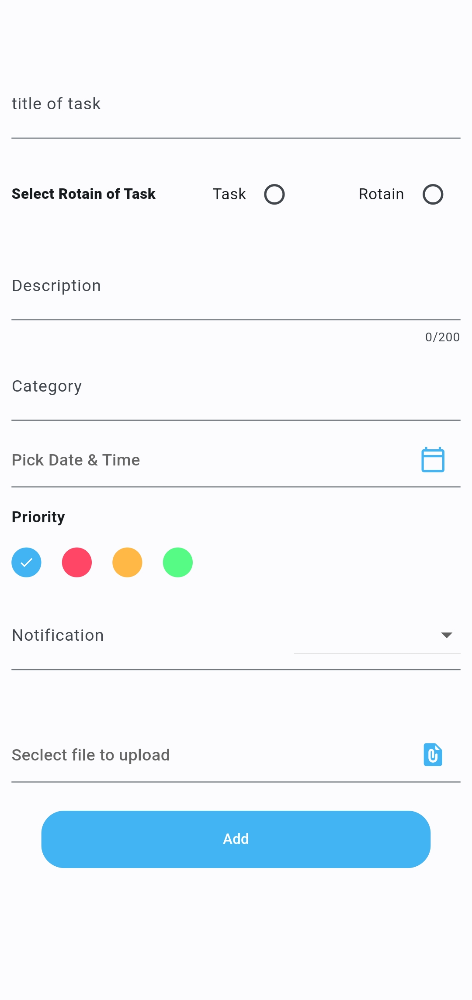
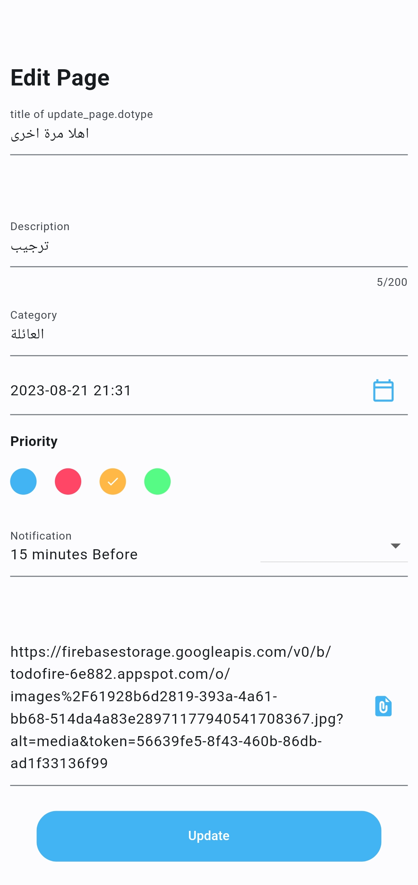
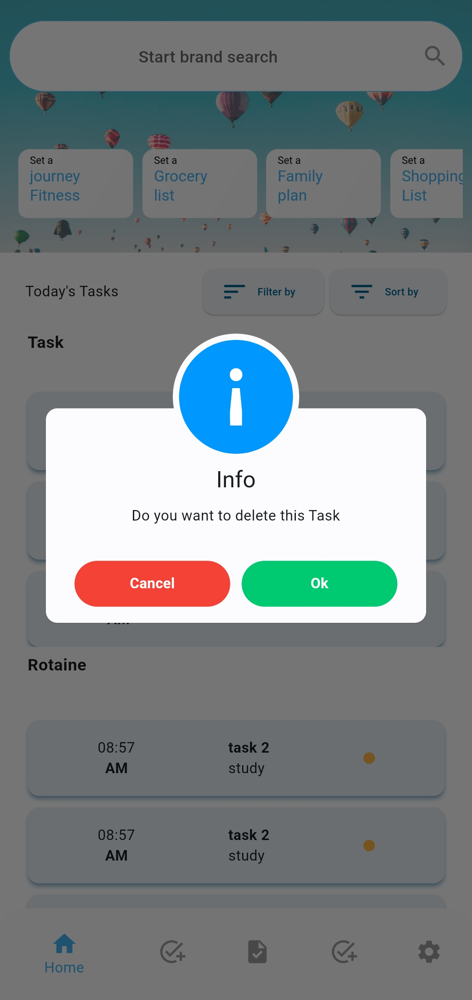

## todo with firebase
A new Flutter project.

## Introduction
____
In This project I use firebase specially firebase_auth to authentication operation firebase_storage to store date and firebase_storage to store Image and use awesome_dialog Package to make dialog  and the resource i used from many xd design i found it in Internet. The Application not complete 100% but I hope to be Helpful to author.

____
## Project operation 
1. Add Task with Image 
2. Delete Task 
3. Update Task 
4. use Dismissible list

___
## register  screen  

___
## Login screen 

___

## Main screen 

___
## Add Screen

## Update Screen

## Delete Screen

